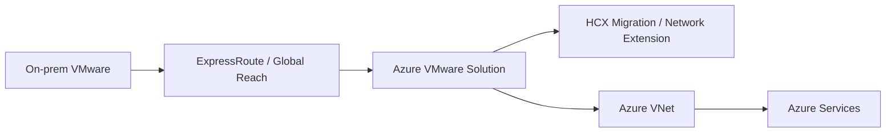
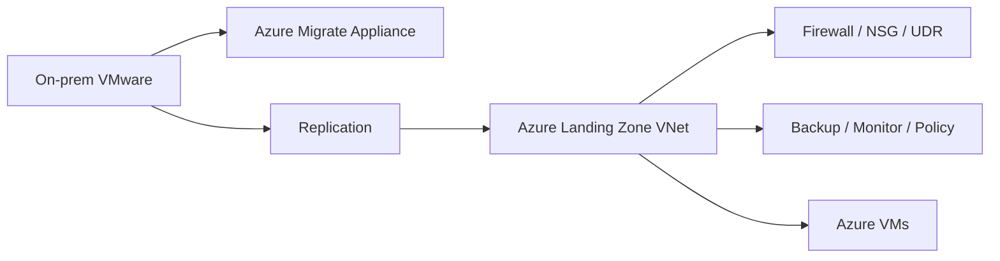

# VMware to Azure Migration - Technical Architecture Deck

## Slide 1 - Title

**VMware to Azure Migration**

Technical architecture, migration patterns, and network design considerations

---

## Slide 2 - Architecture Goals

- Exit VMware-hosted datacenter capacity on schedule
- Preserve stability for tier-1 apps
- Adopt Azure-native operations where practical
- Minimize overlap, routing, and DNS surprises during cutover
- Create a repeatable migration factory

---

## Slide 3 - Reference Target Patterns

| Pattern | Target platform                 | Typical workload                  |
| ------- | ------------------------------- | --------------------------------- |
| P1      | Azure VMs via Azure Migrate     | Standard rehost                   |
| P2      | AVS via HCX                     | Low-change, VMware-dependent apps |
| P3      | AVS then Azure-native           | Urgent exit, later optimization   |
| P4      | Modernize to PaaS or containers | Strategic apps                    |

---

## Slide 4 - Assessment Inputs

- Azure Migrate appliance discovery
- RVTools import for cross-check and rapid baseline
- Performance history for CPU, memory, storage, and uptime
- Dependency mapping across app tiers and shared services
- Network inventory: subnets, overlap, NAT, DNS, firewall, load balancers

---

## Slide 5 - End-to-End Migration Factory

---

## Slide 6 - Target Architecture Comparison

| Area                          | AVS                            | Azure native                            |
| ----------------------------- | ------------------------------ | --------------------------------------- |
| Hypervisor model              | VMware preserved               | Azure fabric                            |
| Admin tools                   | vCenter, NSX, HCX              | Azure portal, ARM, policy, backup       |
| Networking                    | NSX segments plus ExpressRoute | VNet, subnets, UDR, NSG, Azure Firewall |
| Migration motion              | HCX migration patterns         | Azure Migrate replication and cutover   |
| Long-term destination quality | Medium                         | High                                    |

---

## Slide 7 - Network and IP Design Principles

- Eliminate overlapping RFC1918 ranges where possible
- Treat DNS as the primary abstraction layer
- Use IP retention only when there is a clear dependency
- Separate management, migration, and workload connectivity designs
- Validate route symmetry before cutover

---

## Slide 8 - Dedicated IP Address Slide

| Topic                        | AVS                                                                             | Azure native                                                            |
| ---------------------------- | ------------------------------------------------------------------------------- | ----------------------------------------------------------------------- |
| Private IP retention         | Can often be preserved using HCX Network Extension or L2 extension              | Normally changes; same IP requires explicit subnet and failover design  |
| Public IP behavior           | New Azure public IP normally required                                           | New Azure public IP required                                            |
| Routing impact               | Risk of asymmetric routing with stretched networks and on-prem gateway patterns | Risk of overlap and route cutover if same subnet is re-created in Azure |
| Coexistence during migration | Possible, but stretched network design must be controlled                       | Same-address coexistence is limited and often impractical               |
| DNS impact                   | Lower if same private IP is retained                                            | Higher; DNS updates and dependency cleanup are common                   |
| Cutover considerations       | HCX service mesh, L2 extension, MON policy, route validation                    | Target subnet mapping, IP assignment, route changes, DNS TTL reduction  |

Technical notes:
- AVS is generally the better answer when same private IP retention matters.
- Azure native is generally the better answer when long-term landing zone alignment matters more than IP continuity.

---

## Slide 9 - AVS Connectivity Model

Design points:
- AVS requires non-overlapping management address space
- HCX network extension can preserve private IPs
- Routing symmetry must be reviewed carefully

---

## Slide 10 - Azure Native Connectivity Model

Design points:
- Native Azure migration puts more pressure on landing zone readiness
- New subnets, route tables, DNS, and operational controls are usually required

---

## Slide 11 - Landing Zone Readiness Checklist

| Domain     | Minimum requirement                                               |
| ---------- | ----------------------------------------------------------------- |
| Identity   | Entra ID integration, RBAC model, privileged access plan          |
| Network    | Hub-spoke or equivalent, firewall strategy, DNS forwarding        |
| Security   | Policy baseline, NSG patterns, vulnerability and logging controls |
| Operations | Backup, monitoring, patching, incident ownership                  |
| Governance | Naming, tagging, cost model, subscription model                   |

---

## Slide 12 - Workload Placement Scorecard

Scoring: 1 = weak fit, 5 = strong fit

| Workload type            | Azure VMs | AVS | Modernize |
| ------------------------ | --------- | --- | --------- |
| Standard business app    | 5         | 3   | 2         |
| Legacy low-tolerance app | 2         | 5   | 1         |
| Dense VMware-tuned app   | 3         | 5   | 1         |
| Strategic digital app    | 3         | 2   | 5         |
| App with hard-coded IPs  | 2         | 5   | 2         |

---

## Slide 13 - Assumed Customer Scenario

- 700 VMs, 60 TB of provisioned storage
- 2 datacenters exiting within 12 months
- 20 tier-1 apps, 40 tier-2 apps, remainder commodity services
- 15% have IP-sensitive or network-coupled dependencies
- Azure landing zone exists but needs operational hardening
- Team has strong VMware operations capability, moderate Azure capability

---

## Slide 14 - Recommended Technical Pattern for the Scenario

| Segment                          | Target                        | Rationale                                            |
| -------------------------------- | ----------------------------- | ---------------------------------------------------- |
| Commodity app servers            | Azure VMs                     | Fast right-sizing and lowest long-term ops friction  |
| Fragile tier-1 apps              | AVS                           | Lowest change risk and easier IP continuity handling |
| Data-adjacent shared services    | Azure VMs or managed services | Depends on dependency map and supportability         |
| Strategic app refresh candidates | Modernize                     | Best long-term return                                |

Recommended mix:
- 60% Azure VMs
- 25% AVS
- 10% modernization
- 5% retain, retire, or defer

---

## Slide 15 - Pilot Architecture

- 10 to 20 representative workloads
- 1 AVS pilot cluster for hardest apps
- 1 Azure landing zone migration subnet set for native rehost
- Shared observability, backup, identity, and change control
- Formal validation for DNS, routing, rollback, and application smoke tests

---

## Slide 16 - Cutover Runbook Controls

- Lower DNS TTL in advance where possible
- Freeze firewall and route changes before cutover window
- Validate target IP and subnet mappings
- Test failover or migration rehearsal with application owner signoff
- Define rollback threshold and decision owner
- Capture post-cutover performance and incident metrics

---

## Slide 17 - Technical Risks

| Risk                          | Where it appears most         | Mitigation                                   |
| ----------------------------- | ----------------------------- | -------------------------------------------- |
| Overlapping address space     | AVS and Azure native          | Early IPAM review and subnet redesign        |
| Asymmetric routing            | AVS stretched network designs | HCX and route validation before wave cutover |
| Landing zone immaturity       | Azure native                  | Hardening before scale-out                   |
| Permanent transitional sprawl | AVS-first programs            | Time-boxed exit criteria                     |
| Dependency blind spots        | All patterns                  | Dependency mapping and pilot selection       |

---

## Slide 18 - Final Architecture Recommendation

**Default pattern**
- Azure Migrate to Azure VMs for the broad estate

**Exception pattern**
- AVS for low-change critical apps and IP-sensitive legacy tiers

**Strategic pattern**
- Modernize a limited set of long-life apps in parallel

**Board message**
- Use AVS to reduce risk, not to avoid architecture decisions forever
- Use Azure native as the steady-state platform for most workloads